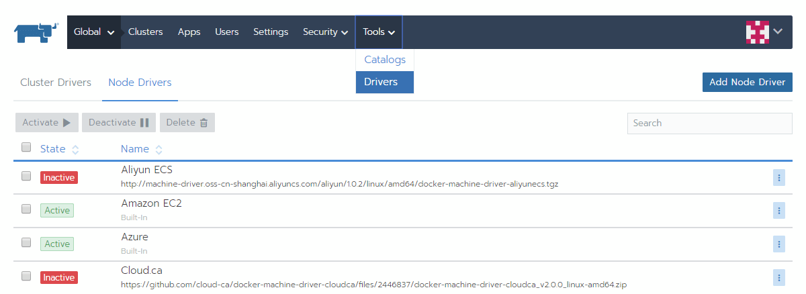
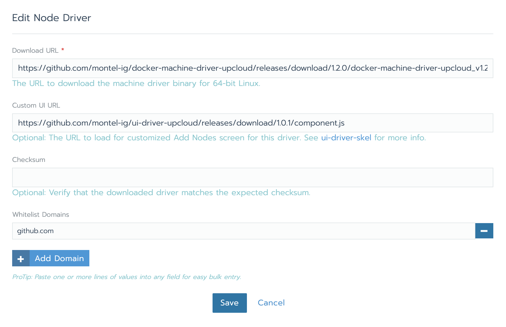
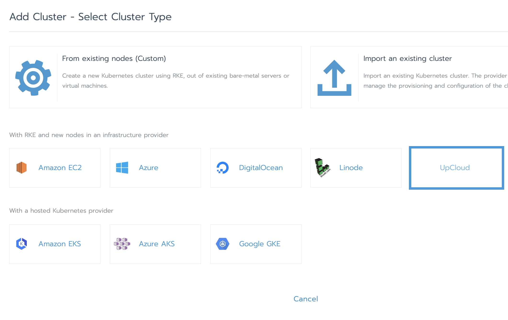

## Como instalar el driver de Rancher para Upcloud

*Este tutorial es una parte de un tutorial en video que pueden encontrar [aquí](https://www.youtube.com/watch?v=74Qd1Kl79P8)*

Rancher permite instalar cualquier driver de cualquier proveedor, siempre y cuando se pueda usar una API para crear VMs e instalarles Docker.

La documentación de Upcloud ya tiene un tutorial [aquí](https://upcloud.com/community/tutorials/get-started-rancher/). Pero parece que algunos links están rotos.

En este pequeño tutorial, vamos a seguir los mismos pasos pero usando los links directamente de Github.com

### Crear el server Rancher

Primero hay que crear un server que vamos a usar para correr nuestro panel de Rancher. Simplemente creamos una VM usando Upcloud y le instalamos Docker siguiendo los siguientes pasos

##### Instalamos las dependencias

```
sudo apt-get install apt-transport-https ca-certificates curl \
gnupg-agent software-properties-common
```

##### Instalamos los repos de Docker

```
curl -fsSL https://download.docker.com/linux/ubuntu/gpg | sudo apt-key add -
sudo add-apt-repository \
   "deb [arch=amd64] https://download.docker.com/linux/ubuntu \
   $(lsb_release -cs) \
   stable"
```

##### Actualizamos apt e instalamos Docker

```
sudo apt-get update
sudo apt-get install docker-ce docker-ce-cli containerd.io docker-compose
```

##### Iniciamos todo con docker-compose

Usamos el archivo docker-compose que está en este mismo repo y lo modificamos con nuestro dominio (este dominio tiene que apuntar a la IP del server que acabamos de crear), luego iniciamos nuestros contenedores:

```
docker-compose up -d
```

### Instalar el driver de Upcloud

Esto va a permitirle a Rancher poder conectarse a Upcloud para crear VMs que después va a poder usar como nodos de Kubernetes.

Una vez logueados en Rancher, vamos a `Tools -> Drivers -> Add Node Driver`



Luego llenamos los siguientes datos

```
Download URL: https://github.com/montel-ig/docker-machine-driver-upcloud/releases/download/1.2.0/docker-machine-driver-upcloud_v1.2.0-2-ga70b638_linux-amd64.zip
Custom UI URL: https://github.com/montel-ig/ui-driver-upcloud/releases/download/1.0.1/component.js
Whitelist Domains: github.com
```



El Custom UI URL es simplemente para tener una URL mas bonita a la hora de crear nuestros perfiles para los workers, no es necesaria

Y listo! Ahora podemos crear un cluster seleccionando Upcloud como nuestro proveedor



