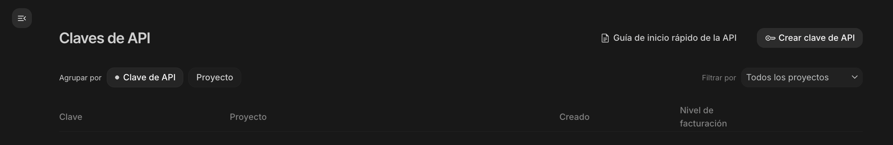
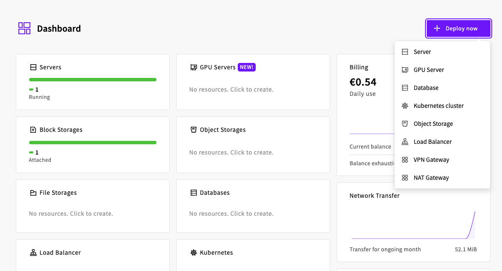
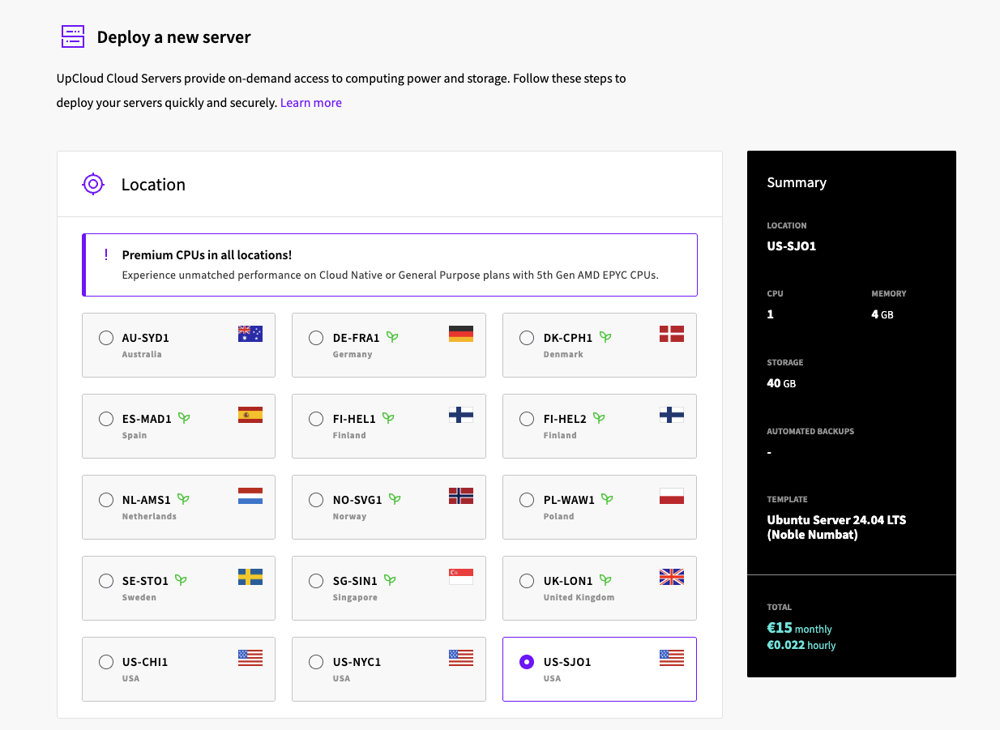
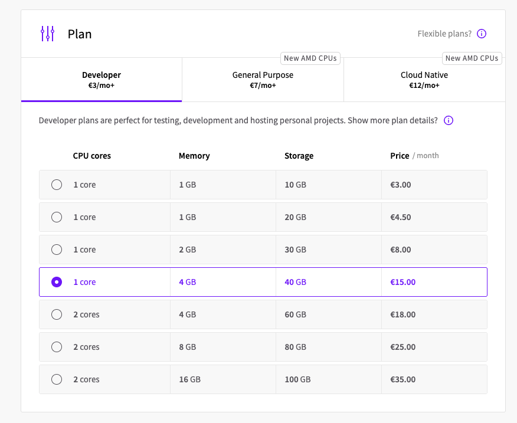
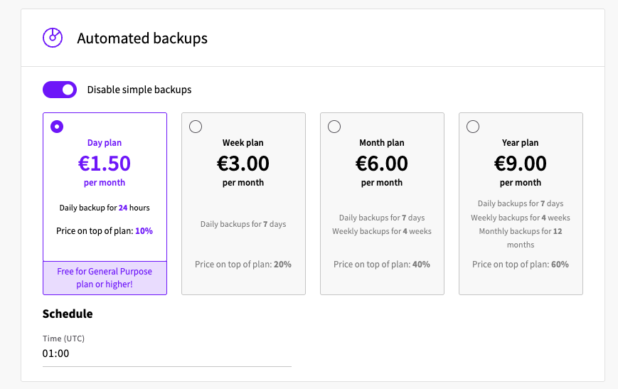
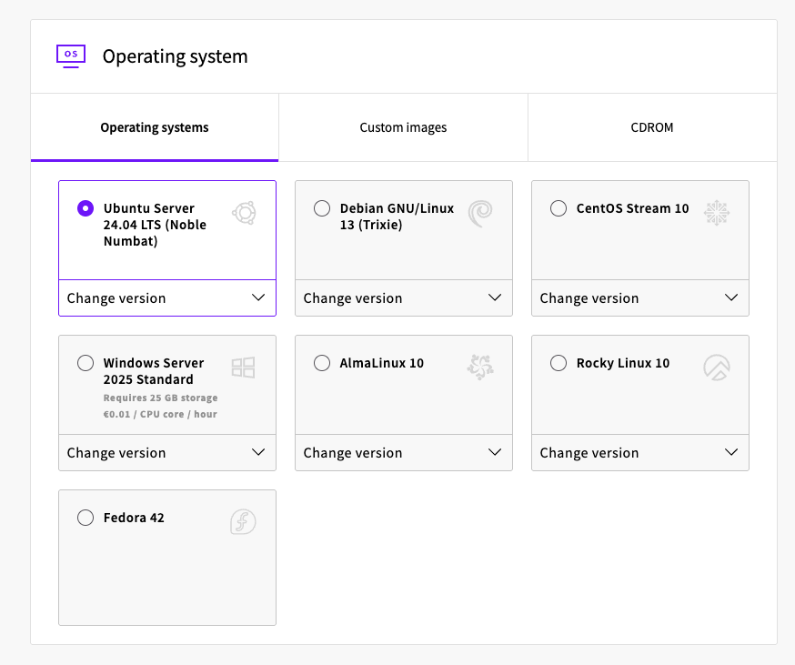
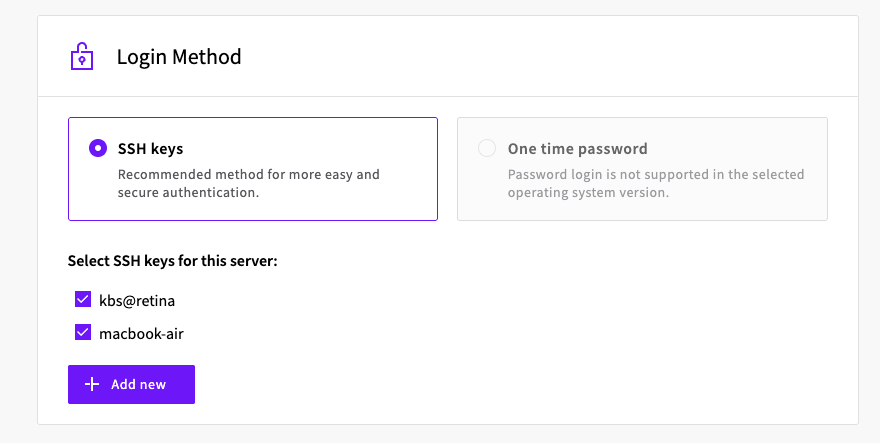
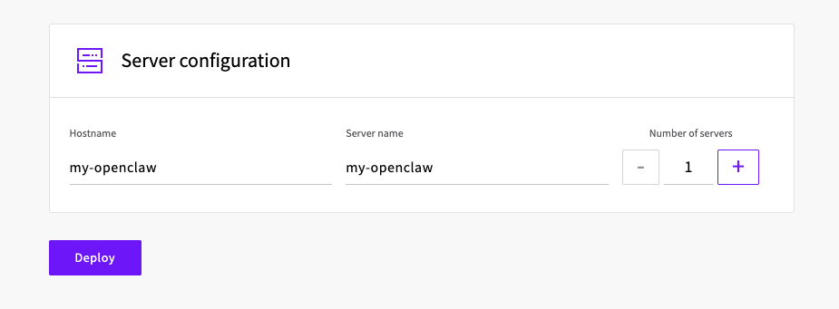
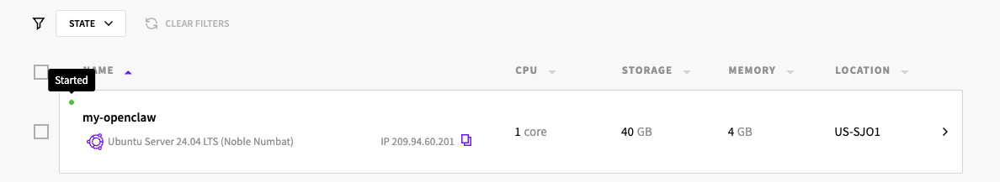

# Openclaw Tutorial

OpenClaw es un agente IA. Pero puede resumirse a un simple software o servicio que puede correr en tu laptop, un servidor físico o un servidor cloud en cualquier lugar del mundo.

## OpenClaw vs ChatGPT

Las diferencias principales entre OpenClaw y ChatGPT, Gemini u otros chats AI, son 4:

* Puede vivir en tu propia infraestructura, donde controlas exactamente lo que corre y qué accesos tiene
* Tiene cronjobs y heartbeat, puedes programar tareas para que trabaje por su cuenta sin ninguna interacción humana.
* Tiene memoria de lo que le hablas y lo que hace, por lo que a medida que pasa el tiempo, se hace más útil y te conoce más.
* Tiene herramientas (tools) y habilidades (skills). Con estas herramientas, puede conectarse a servicios externos, como Mail, Calendario, un buscador, y prácticamente cualquier cosa que pueda correr en una computadora.

Otra cosa importante con respecto a OpenClaw, es su gateway. OpenClaw es un binario que puede conectarse a diferentes "canales", que usa para comunicarse con el humano. Estos canales pueden ser Whatsapp, Telegram, Slack, y muchos más. Por lo que podemos contactarlo fácilmente con muchos métodos.

## Instalación y configuración

### Pre-requisitos

#### Key de LLM

Antes de instalar OpenClaw, necesitamos tener al menos una llave API (API Key) con acceso a una LLM. Esta LLM puede ser la que prefieras, OpenAI, Gemini, Kimi de Nvidia, o incluso Ollama, un servicio que te permite correr tu propio modelo de forma gratuita.

Cada uno de estos servicios tienen sus pros y contras, los que los diferencia son principalmente el costo. Los mejores modelos son los más caros, estos modelos son más rápidos y más "inteligentes", por lo que interactuar con ellos es mucho más fácil. Mientras mejor sea el modelo, mejor será su habilidad para resolver problemas. Un modelo más barato puede llegar a costarle resolver algunos problemas más complejos. La clave es encontrar un balance entre un modelo que pueda resolver tus tareas del día a día y a la vez no costarte una fortuna.

Para esta guía vamos a usar Gemini. Puedes usar Gemini en modo prueba gratuita simplemente teniendo una cuenta de Google. [Guía Oficial de OpenClaw](https://docs.openclaw.ai/providers/google)

Para crear una key de Gemini, puedes ir a [Google AI Studio](https://aistudio.google.com/api-keys) y crear una key de API



Una vez que creamos la key, vamos a guardar esa llave como un secreto. La usaremos más adelante para configurar OpenClaw.

#### Bot de Telegram

Para esta guia vamos a crear un Bot de Telegram que nos permitirá comunicarnos con nuestro agente por medio de este mensajero. En el caso de que prefieras usar otro método como [Whatsapp](https://docs.openclaw.ai/channels/whatsapp) o [Discord](https://docs.openclaw.ai/channels/discord), te recomiendo que sigas las guias oficiales.

Para crear un Bot de Telegram es super simple ([guía oficial](https://docs.openclaw.ai/channels/telegram))

1. Abre Telegram y chatea con `@BotFather` (este es un Bot de Telegram que se encargar de crear Bots)
2. Tipea `/newbot` en esa conversación. El bot te preguntará el nombre de tu Bot, puedes elegir el que quieras. Con este bot vas a chatear para contactar con tu agente.
3. `@BotFather` te responderá con un token, guarda este token porque lo usaremos para autenticar con Telegram más adelante.


### Despliegue de Servidor

Para instalar OpenClaw, vamos a hacerlo en un servidor de Upcloud

Para esto necesitamos ir a nuestro Dashboard de Upcloud y desplegar un nuevo servidor.



Seleccionamos la zona en donde lo vamos a desplegar, intenta encontrar una zona cercana a tu ubicación real, para disminuir la latencia, pero esto realmente no es tan importante



Aquí seleccionaremos el tamaño de la instancia, recomiendo un servidor con al menos 2GB de ram para no tener problemas, 4GB de ram me parece ideal para un setup inicial. Esto después lo puedes cambiar si necesitas más potencia.



Los respaldos son importantes, toda la configuración, memoria, y archivos de trabajo de OpenClaw deben ser resguardados ante cualquier emergencia, siempre que tengas algun problema, puedes restaurar un respaldo y volver a un punto anterior facilmente.



Para esta guia vamos a usa Ubuntu como sistema operativo, el sistema operativo no es tan importante, ya que el instalador funciona en los sistemas operativos más populares, pero Ubuntu siempre es una buena opción.



Seleccionamos nuestra key de SSH, le damos un nombre al server, y desplegamos.

 

Una vez que el servidor esté corriendo, vamos a copiar la dirección IP del servidor, y usaremos una terminal para conectarnos por medio de SSH. Si en el paso anterior usaste una key SSH, debes usar esa misma key para conectarte.



```bash
# Reemplaza esta ip por la IP de tu servidor
ssh root@209.94.60.201
```

Una vez dentro del servidor, ya estamos listos para instalar OpenClaw!

### Instalación de OpenClaw

Nuestro servidor para OpenClaw ya está listo. Ahora es hora de instalar el software de OpenClaw. Es realmente muy fácil y solo requiere una simple línea:

```bash
curl -fsSL https://openclaw.ai/install.sh | bash
```

Esta comando instalará todas las dependencias y el software de OpenClaw de una sola vez, no tenemos que instalar absolutamente nada antes de correrlo, nuestra instalación fresca de Ubuntu tiene todas las herramientas necesarias.

```
root@my-openclaw:~# curl -fsSL https://openclaw.ai/install.sh | bash

  🦞 OpenClaw Installer
  End-to-end encrypted, Zuck-to-Zuck excluded.

✓ Detected: linux

Install plan
OS: linux
Install method: npm
Requested version: latest

[1/3] Preparing environment
· Node.js not found, installing it now
· Installing Node.js via NodeSource
· Installing Linux build tools (make/g++/cmake/python3)
```

Este paso puede llevar un par de minutos dependiendo de la velocidad de internet y de la cantidad de dependencias necesarias, debería ser bastante rápido!

Una vez instaladas las dependencias, el instalador procederá a instalar la última versión disponible de OpenClaw e iniciará el proceso de configuración inicial.

```
[1/3] Preparing environment
· Node.js not found, installing it now
· Installing Node.js via NodeSource
· Installing Linux build tools (make/g++/cmake/python3)
✓ Build tools installed
✓ Node.js v22 installed
· Active Node.js: v22.22.1 (/usr/bin/node)
· Active npm: 10.9.4 (/usr/bin/npm)

[2/3] Installing OpenClaw
✓ Git already installed
· Installing OpenClaw v2026.3.23-2
✓ OpenClaw npm package installed
✓ OpenClaw installed

[3/3] Finalizing setup

🦞 OpenClaw installed successfully (OpenClaw 2026.3.23-2 (7ffe7e4))!
The lobster has landed. Your terminal will never be the same.
```

Veremos un pequeño disclaimer explicando que OpenClaw es una herramienta poderosa que puede causar mucho daño, aceptaremos esto cambiando a Yes y tocando Enter

```
🦞 OpenClaw 2026.3.23-2 (7ffe7e4) — I keep secrets like a vault... unless you print them in debug logs again.

▄▄▄▄▄▄▄▄▄▄▄▄▄▄▄▄▄▄▄▄▄▄▄▄▄▄▄▄▄▄▄▄▄▄▄▄▄▄▄▄▄▄▄▄▄▄▄▄▄▄▄▄
██░▄▄▄░██░▄▄░██░▄▄▄██░▀██░██░▄▄▀██░████░▄▄▀██░███░██
██░███░██░▀▀░██░▄▄▄██░█░█░██░█████░████░▀▀░██░█░█░██
██░▀▀▀░██░█████░▀▀▀██░██▄░██░▀▀▄██░▀▀░█░██░██▄▀▄▀▄██
▀▀▀▀▀▀▀▀▀▀▀▀▀▀▀▀▀▀▀▀▀▀▀▀▀▀▀▀▀▀▀▀▀▀▀▀▀▀▀▀▀▀▀▀▀▀▀▀▀▀▀▀
                  🦞 OPENCLAW 🦞

┌  OpenClaw setup
│
◇  Security ─────────────────────────────────────────────────────────────────────────────────╮
│                                                                                            │
│  Security warning — please read.                                                           │
│                                                                                            │
│  OpenClaw is a hobby project and still in beta. Expect sharp edges.                        │
│  By default, OpenClaw is a personal agent: one trusted operator boundary.                  │
│  This bot can read files and run actions if tools are enabled.                             │
│  A bad prompt can trick it into doing unsafe things.                                       │
│                                                                                            │
│  OpenClaw is not a hostile multi-tenant boundary by default.                               │
│  If multiple users can message one tool-enabled agent, they share that delegated tool      │
│  authority.                                                                                │
│                                                                                            │
│  If you’re not comfortable with security hardening and access control, don’t run           │
│  OpenClaw.                                                                                 │
│  Ask someone experienced to help before enabling tools or exposing it to the internet.     │
│                                                                                            │
│  Recommended baseline:                                                                     │
│  - Pairing/allowlists + mention gating.                                                    │
│  - Multi-user/shared inbox: split trust boundaries (separate gateway/credentials, ideally  │
│    separate OS users/hosts).                                                               │
│  - Sandbox + least-privilege tools.                                                        │
│  - Shared inboxes: isolate DM sessions (`session.dmScope: per-channel-peer`) and keep      │
│    tool access minimal.                                                                    │
│  - Keep secrets out of the agent’s reachable filesystem.                                   │
│  - Use the strongest available model for any bot with tools or untrusted inboxes.          │
│                                                                                            │
│  Run regularly:                                                                            │
│  openclaw security audit --deep                                                            │
│  openclaw security audit --fix                                                             │
│                                                                                            │
│  Must read: https://docs.openclaw.ai/gateway/security                                      │
│                                                                                            │
├────────────────────────────────────────────────────────────────────────────────────────────╯
│
◆  I understand this is personal-by-default and shared/multi-user use requires lock-down. Continue?
│  ● Yes / ○ No
└
```

Seleccionaremos el modo "Quickstart"

```
◆  Setup mode
│  ● QuickStart (Configure details later via openclaw configure.)
│  ○ Manual
└
```

En este modo, empezamos configurando la parte más importante de OpenClaw, su cerebro: El LLM que vamos a usar. Aquí es donde usaremos nuestra key de Gemini. Si tienes otra key, puedes seleccionar el proveedor que tengas.

```
◇  QuickStart ─────────────────────────╮
│                                      │
│  Gateway port: 18789                 │
│  Gateway bind: Loopback (127.0.0.1)  │
│  Gateway auth: Token (default)       │
│  Tailscale exposure: Off             │
│  Direct to chat channels.            │
│                                      │
├──────────────────────────────────────╯
│
◆  Model/auth provider
│  ○ Anthropic
│  ○ BytePlus
│  ○ Chutes
│  ○ Cloudflare AI Gateway
│  ○ Copilot
│  ○ Custom Provider
│  ○ DeepSeek
│  ● Google (Gemini API key + OAuth)
│  ○ Hugging Face
│  ○ Kilo Gateway
│  ○ LiteLLM
│  ○ Microsoft Foundry
│  ○ MiniMax
│  ○ Mistral AI
│  ○ Moonshot AI (Kimi K2.5)
│  ○ Ollama
│  ○ OpenAI
│  ○ OpenCode
│  ○ OpenRouter
│  ○ Qianfan
│  ○ Qwen (Alibaba Cloud Model Studio)
│  ○ SGLang
│  ○ Synthetic
│  ○ Together AI
│  ○ Venice AI
│  ○ Vercel AI Gateway
│  ○ vLLM
│  ○ Volcano Engine
│  ○ xAI (Grok)
│  ○ Xiaomi
│  ○ Z.AI
│  ○ Skip for now
```

Aquí seleccionaremos la key en lugar de Cli Oauth:

```
◆  Google auth method
│  ○ Gemini CLI OAuth
│  ● Google Gemini API key
│  ○ Back
└
```

Introducimos nuestra key:

```
◇  Google auth method
│  Google Gemini API key
│
◆  Enter Gemini API key
│  AIza...xxxx..IY6c
└
```

Aquí seleccionaremos el modelo. Este paso es bastante importante ya que el modelo que escojamos va a definir la "inteligencia" de nuestro agente y el costo que vamos a tener. Los modelos mas "inteligentes" son los mas caros, o sea, el valor por token es mas elevado.

En esta guia vamos a elegir el mejor modelo a la fecha: `google/gemini-3.1-pro-preview`, mi recomendación es que pruebes los modelos y revises el costo y si estás OK con pagar eso, en el caso de que te parezca muy caro, puedes ir por uno mas barato, como `google/gemini-flash-latest` o `google/gemini-flash-lite-latest`. Los modelos `flash-lite` son extremadamente baratos y funcionan muy bien para tareas simples.

```
◇  Model configured ───────────────────────────────────╮
│                                                      │
│  Default model set to google/gemini-3.1-pro-preview  │
│                                                      │
├──────────────────────────────────────────────────────╯
12:09:21+00:00 [agents/model-providers] [xai-auth] bootstrap config fallback: no config-backed key found
│
◆  Default model
│  ● Keep current (google/gemini-3.1-pro-preview)
│  ○ Enter model manually
│  ○ google/gemini-1.5-flash
│  ○ google/gemini-1.5-flash-8b
│  ○ google/gemini-1.5-pro
│  ○ google/gemini-2.0-flash
│  ○ google/gemini-2.0-flash-lite
│  ○ google/gemini-2.5-flash
│  ○ google/gemini-2.5-flash-lite
│  ○ google/gemini-2.5-flash-lite-preview-06-17
│  ○ google/gemini-2.5-flash-lite-preview-09-2025
│  ○ google/gemini-2.5-flash-preview-04-17
│  ○ google/gemini-2.5-flash-preview-05-20
│  ○ google/gemini-2.5-flash-preview-09-2025
│  ○ google/gemini-2.5-pro
│  ○ google/gemini-2.5-pro-preview-05-06
│  ○ google/gemini-2.5-pro-preview-06-05
│  ○ google/gemini-3-flash-preview
│  ○ google/gemini-3-pro-preview
│  ○ google/gemini-3.1-flash-lite-preview
│  ○ google/gemini-3.1-pro-preview
│  ○ google/gemini-3.1-pro-preview-customtools
│  ○ google/gemini-flash-latest
│  ○ google/gemini-flash-lite-latest
│  ○ google/gemini-live-2.5-flash
│  ○ google/gemini-live-2.5-flash-preview-native-audio
```

Ahora vamos a elegir el canal (channel). El channel es la forma en la que tenemos para comunicarnos con nuestro bot aparte de la interfaz web. Las opciones más populares son Telegram, Whatsapp y Discord. Pero tenemos muchas más para elegir.

En este paso, vamos a usar la key de Telegram para el bot que creamos en la parte de los pre-requisitos.

Vamos a elegir Telegram y poner nuestra key

```
◆  Select channel (QuickStart)
│  ● Telegram (Bot API) (recommended · newcomer-friendly)
│  ○ WhatsApp (QR link)
│  ○ Discord (Bot API)
│  ○ IRC (Server + Nick)
│  ○ Google Chat (Chat API)
│  ○ Slack (Socket Mode)
│  ○ Signal (signal-cli)
│  ○ iMessage (imsg)
│  ○ LINE (Messaging API)
│  ○ Mattermost (plugin)
│  ○ Nextcloud Talk (self-hosted)
│  ○ Feishu/Lark (飞书)
│  ○ BlueBubbles (macOS app)
│  ○ Zalo (Bot API)
│  ○ Synology Chat (Webhook)
│  ○ Nostr (NIP-04 DMs)
│  ○ Microsoft Teams (Teams SDK)
│  ○ Matrix (plugin)
│  ○ Zalo (Personal Account)
│  ○ Tlon (Urbit)
│  ○ Twitch (Chat)
│  ○ Skip for now
```

```
◇  Select channel (QuickStart)
│  Telegram (Bot API)
│
◇  Telegram bot token ───────────────────────────────────────────────────────────────────╮
│                                                                                        │
│  1) Open Telegram and chat with @BotFather                                             │
│  2) Run /newbot (or /mybots)                                                           │
│  3) Copy the token (looks like 123456:ABC...)                                          │
│  Tip: you can also set TELEGRAM_BOT_TOKEN in your env.                                 │
│  Docs: https://docs.openclaw.ai/telegram  │
│  Website: https://openclaw.ai                                                          │
│                                                                                        │
├────────────────────────────────────────────────────────────────────────────────────────╯
│
◆  How do you want to provide this Telegram bot token?
│  ● Enter Telegram bot token (Stores the credential directly in OpenClaw config)
│  ○ Use external secret provider
```

Listo! Finalmente vamos a elegir un Search Provider. Esto sirve para permitirle a OpenClaw hacer búsquedas en internet. Podemos usar la que viene por defecto, **DuckDuckGo Search**, que es gratis y no requiere configuración.

```
◇  Web search ─────────────────────────────────────────────────────────────────╮
│                                                                              │
│  Web search lets your agent look things up online.                           │
│  Choose a provider. Some providers need an API key, and some work key-free.  │
│  Docs: https://docs.openclaw.ai/tools/web                                    │
│                                                                              │
├──────────────────────────────────────────────────────────────────────────────╯
│
◆  Search provider
│  ○ Brave Search
│  ● DuckDuckGo Search (experimental) (Free web search fallback with no API key required · key-free)
│  ○ Exa Search
│  ○ Firecrawl Search
│  ○ Gemini (Google Search)
│  ○ Grok (xAI)
│  ○ Kimi (Moonshot)
│  ○ Perplexity Search
│  ○ Tavily Search
│  ○ Skip for now
```

Los skills son integraciones para conectarnos con herramientas externas, mi recomendación es no instalar ninguna skill por ahora, e ir conociendo a OpenClaw para ver qué accesos les vamos a ir dando.

```
│
◇  Skills status ─────────────╮
│                             │
│  Eligible: 4                │
│  Missing requirements: 39   │
│  Unsupported on this OS: 7  │
│  Blocked by allowlist: 0    │
│                             │
├─────────────────────────────╯
│
◇  Configure skills now? (recommended)
│  No
│
```
Los hooks son automatizaciones por medio de comandos con barra `/comando`. Por ahora no vamos a configurar ninguno de estos ya que son un poco mas avanzados.

```
◇  Hooks ──────────────────────────────────────────────────────────────────╮
│                                                                          │
│  Hooks let you automate actions when agent commands are issued.          │
│  Example: Save session context to memory when you issue /new or /reset.  │
│                                                                          │
│  Learn more: https://docs.openclaw.ai/automation/hooks                   │
│                                                                          │
├──────────────────────────────────────────────────────────────────────────╯
│
◆  Enable hooks?
│  ◻ Skip for now
│  ◻ 🚀 boot-md
│  ◻ 📎 bootstrap-extra-files
│  ◻ 📝 command-logger
│  ◻ 💾 session-memory
```

Listo! Ya tenemos openclaw corriendo. 

Ahora podemos acceder a nuestra interfaz web, usando el link que nos aparece en este recuadro.

```
◇  Control UI ───────────────────────────────────────────────────────────────────────────────╮
│                                                                                            │
│  Web UI: http://127.0.0.1:18789/                                                           │
│  Web UI (with token):                                                                      │
│  http://127.0.0.1:18789/#token=b255663316c7babcd07cc5b4d4de5a5ffd3a0e252d4fb69f            │
│  Gateway WS: ws://127.0.0.1:18789                                                          │
│  Gateway: not detected (gateway closed (1006 abnormal closure (no close frame)): no close  │
│  reason)                                                                                   │
│  Docs: https://docs.openclaw.ai/web/control-ui                                             │
│                                                                                            │
├────────────────────────────────────────────────────────────────────────────────────────────╯
```

Una cosa muy importante es que este link solamente es válido para localhost, por lo que no podemos ingresar de forma externa con la IP de nuestro servidor. Esto es más seguro! De esta forma esta interfaz sólamente es accesible cuando nos conectemos por medio de SSH, usando un túnel de SSH. 

Vamos a tener que abrir una segunda terminal para habilitar este túnel (o podemos cerrar nuestra sesión actual y volverla a abrir):

ssh -L 18789:localhost:18789 root@<IP-DEL-SERVIDOR>

Una vez que nos conectemos por SSH con estas opciones, vamos a poder acceder al puerto 18789 del servidor apuntándolo al mismo puerto de nuestra laptop.

En el caso de que necesitemos un nuevo link, podemos ejecutar `openclaw dashboard --no-open`, donde nos mostrará nuevamente el link para ingresar:

```
openclaw dashboard --no-open

Dashboard URL: http://127.0.0.1:18789/#token=b255663316c7babcd07cc5b4d4de5a5ffd3a0e252d4fb69f
```

Diviértete usando OpenClaw 🦞 en Upcloud!

